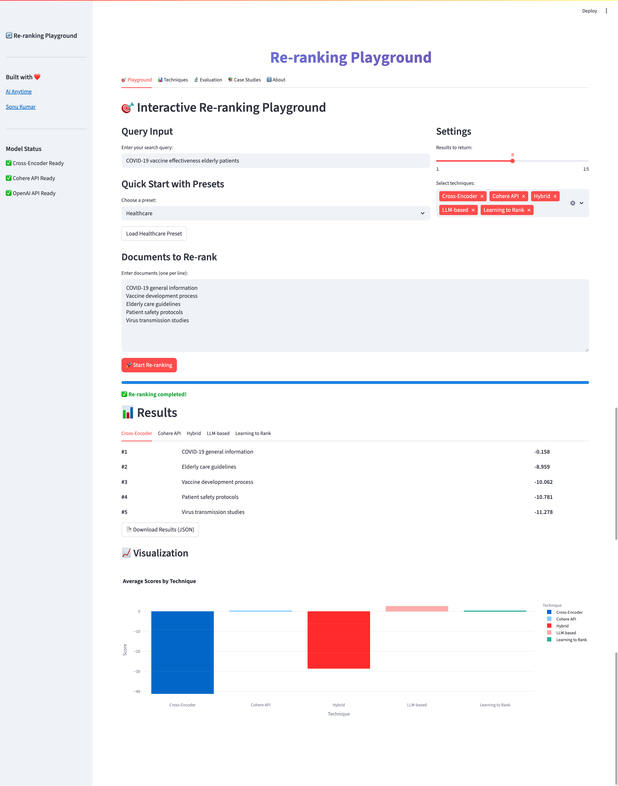
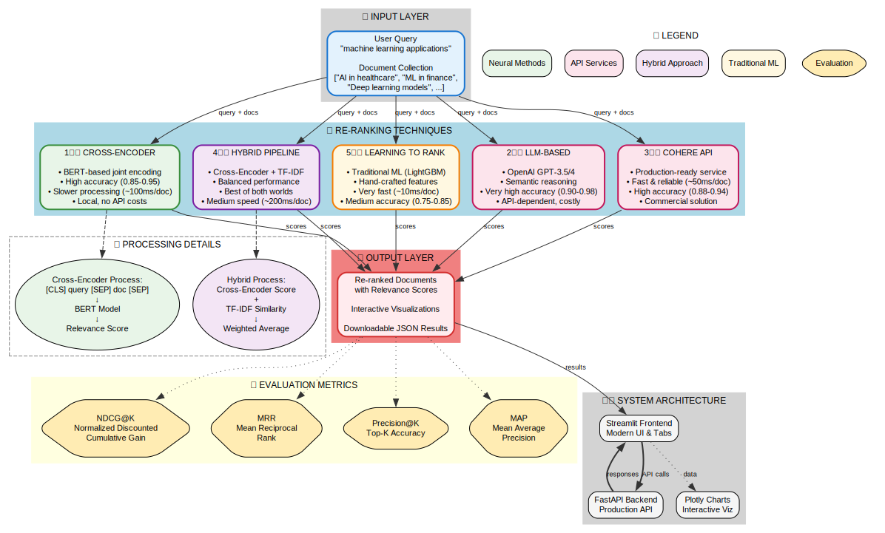

# 🔄 Re-ranking Playground

> An interactive platform for exploring and comparing 5 different document re-ranking techniques with real-time evaluation and visualization for improving the accuracy of RAG systems.

[](https://python.org)
[](https://streamlit.io)
[](https://fastapi.tiangolo.com)
[](LICENSE)



## Features

- **5 Re-ranking Techniques**: Cross-Encoder, LLM-based, Cohere API, Hybrid Pipeline, Learning to Rank
- **Interactive Playground**: Custom queries/documents + 4 preset categories (Technology, Science, Business, Healthcare)
- **Real-time Evaluation**: NDCG, MRR, MAP, Precision@K with interactive Plotly visualizations
- **Production API**: FastAPI backend with comprehensive endpoints and documentation
- **Educational Content**: Code examples, case studies, and "Lost in the Middle" problem explanation
- **Modern UI**: Streamlit interface with session persistence, loaders, and downloadable JSON results

## Quick Start

### Prerequisites
- Python 3.8+
- OpenAI API key (for LLM-based re-ranking)
- Cohere API key (for Cohere re-ranking)

### Installation

```bash
# Clone repository
git clone https://github.com/AIAnytime/Re-ranking-Playground
cd Re-ranking-Playground

# Create environment file
echo "OPENAI_API_KEY=your_openai_key_here" > .env
echo "COHERE_API_KEY=your_cohere_key_here" >> .env

# Install dependencies
pip install -r requirements.txt
```

### Usage

**Launch Streamlit App:**
```bash
streamlit run app.py
```
🌐 **Access**: http://localhost:8501

**Start FastAPI Backend:**
```bash
uvicorn api:app --reload
```
🌐 **API Docs**: http://localhost:8000/docs

## Re-ranking Techniques

| Technique | Accuracy | Speed | Cost | Best Use Case |
|-----------|----------|-------|------|---------------|
| **Cross-Encoder** | High (0.85-0.95) | Slow (~100ms/doc) | Free | High accuracy needs |
| **LLM-based** | Very High (0.90-0.98) | Very Slow (1-3s) | High ($0.002/1K tokens) | Complex reasoning |
| **Cohere API** | High (0.88-0.94) | Fast (~50ms/doc) | Medium ($0.001/search) | Production systems |
| **Hybrid Pipeline** | High (0.86-0.93) | Medium (~200ms/doc) | Low | Balanced performance |
| **Learning to Rank** | Medium (0.75-0.85) | Very Fast (~10ms/doc) | Free | High-volume systems |

## How It Works

1. **Input**: Query + Document collection
2. **Processing**: Apply selected re-ranking technique(s)
3. **Evaluation**: Calculate NDCG, MRR, MAP, Precision@K metrics
4. **Visualization**: Interactive charts and comparisons
5. **Export**: Download results as JSON



## The "Lost in the Middle" Problem

Stanford research shows LLMs struggle with information in the middle of long contexts, significantly impacting RAG systems:

- **Problem**: Most relevant documents get lost in middle positions
- **Impact**: Up to 40% degradation in search quality
- **Solution**: Re-ranking optimizes document ordering for better LLM processing

## API Reference

### Endpoints
- `POST /rerank` - Re-rank documents using specified technique
- `GET /health` - Health check and model status
- `GET /` - API information

### Example Usage
```python
import requests

response = requests.post("http://localhost:8000/rerank", json={
    "query": "machine learning applications",
    "documents": ["AI in healthcare", "ML in finance", "Deep learning"],
    "technique": "cross_encoder",
    "top_k": 5
})
```

## Tech Stack

- **Frontend**: Streamlit + Custom CSS
- **Backend**: FastAPI + Async Support
- **Models**: Sentence Transformers, OpenAI GPT, Cohere API
- **Visualization**: Plotly Interactive Charts
- **ML**: scikit-learn, LightGBM, NumPy

## References

- [Lost in the Middle (Stanford, 2023)](https://cs.stanford.edu/~nfliu/papers/lost-in-the-middle.tacl2023.pdf)
- [MS MARCO Dataset](https://microsoft.github.io/msmarco/)
- [Sentence Transformers](https://www.sbert.net/)
- [Cohere Rerank API](https://docs.cohere.com/reference/rerank)

---

**Built with ❤️ by [AI Anytime](https://aianytime.net) & [Sonu Kumar](https://sonukumar.site)**

---

**Note**: Ensure your API keys are properly configured in the `.env` file for full functionality.
